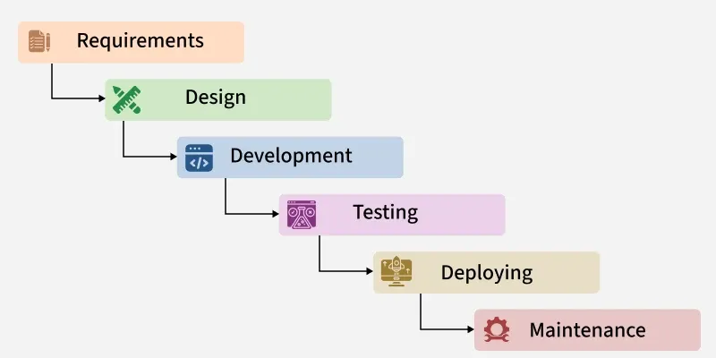

# Unit 1 : Part 4

## Waterfall Model

**Definition:**
The Waterfall Model is a traditional, linear, and sequential software development model in which each phase of the development process is completed before the next phase begins. The output of one phase serves as the input for the next phase. Since the model follows a fixed sequence, backtracking is generally not allowed, and changes after completing a phase are difficult and costly. Due to its well-structured approach, clear milestones, and predictable workflow, the Waterfall Model is simple to understand, easy to manage, and suitable for projects with well-defined and stable requirements.

Picture 1: Waterfall Model
## Why is it Called the Waterfall Model?

The model is called the Waterfall Model because the development process flows downward through a series of phases, just as water flows from the top of a waterfall to the bottom. Once water flows to the next level, it cannot return to the previous level. Similarly, in the Waterfall Model, each phase must be completed before moving to the next, and returning to a completed phase is generally not possible.

## Phases of Waterfall Model
Classical Waterfall Model divides the life cycle into a set of phases. The development process can be considered as a sequential flow in the waterfall. The different sequential phases of the classical waterfall model are follow:

### 1. **Requirements Analysis and Specification**
This phase focuses on clearly understanding and documenting the customer’s needs.

- **Requirement Gathering and Analysis:**
  - Customer requirements are collected and carefully examined to remove errors, confusion, and inconsistencies.
- **Requirement Specification:**
  - The approved requirements are documented in the Software Requirement Specification (SRS), which serves as a formal agreement between the customer and the development team.

### 2. **Design**
In this phase, the requirements from the SRS are converted into a system design that can be implemented in code.

- **High-Level Design (HLD):**
Defines the overall system architecture, major components, and their interactions.
- **Low-Level Design (LLD):**
Provides detailed design of each component, including logic and data flow, to guide developers during coding.
- All designs are documented in the Software Design Document (SDD).

### 3. **Development**
This phase involves converting the design into actual working software.

- Developers write source code based on the design documents.
- Suitable programming languages and tools are used.
- Unit testing is performed to verify that each module works correctly on its own.

### 4. **Testing** 
This phase ensures that the integrated software functions correctly and is successfully delivered for real world use.
- After development, the software is tested to ensure it meets the requirements and works as expected.
- Unit tests, integration tests, and end-to-end tests are performed to validate the software.
- Defects are identified and fixed before deployment.

### 5. **Deployment**
This phase involves releasing the software to the end users.
- After successful testing, the software is deployed to a live environment for end users. This phase includes environment setup, user training, and final checks to ensure smooth operation in real world conditions.

### 6. **Maintenance**
Maintenance ensures the software continues to function effectively after deployment.
- Periodic updates and upgrades are performed to address new requirements, bugs, or security vulnerabilities.
- Support and maintenance services are provided to users to address any issues that may arise.

## Advantages of Waterfall Model
- Simple and easy to understand.
- Easy to manage due to clearly defined phases.
- Well-structured development process.
- Clear documentation at every stage.
- Suitable for small projects with stable requirements.
- Easy to estimate cost and development time.

## Disadvantages of Waterfall Model
- Difficult to accommodate changing requirements.
- No working software is available until the later stages.
- Testing begins only after implementation is complete.
- Errors discovered late can be expensive to fix.
- Not suitable for large, complex, or rapidly changing projects.

## Use Cases of Waterfall Model
The Waterfall Model is suitable for:

- Government projects
- Banking systems with fixed requirements
- Educational software
- Payroll management systems
- Small business applications
- Projects with clearly defined requirements